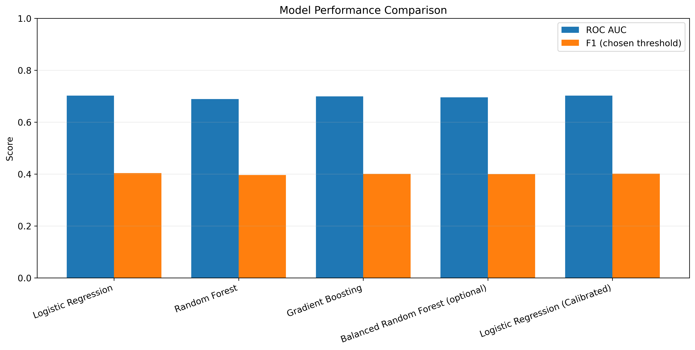
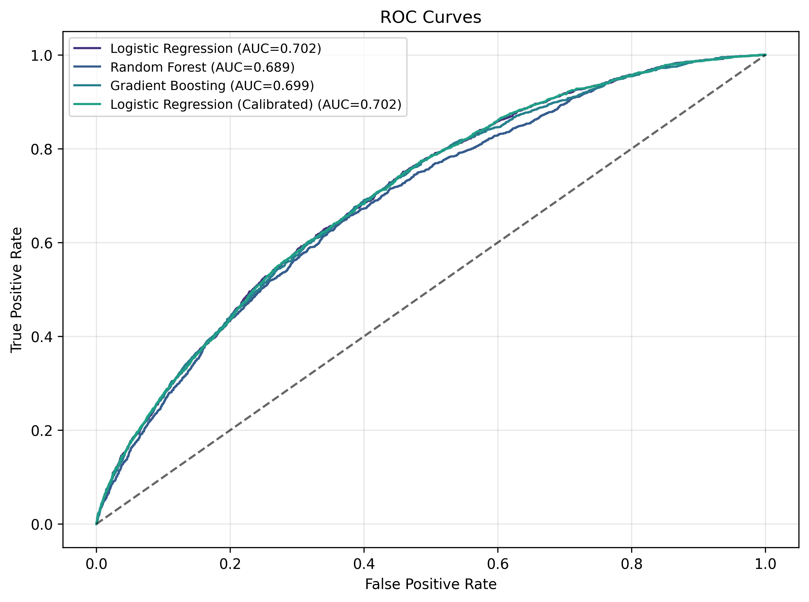
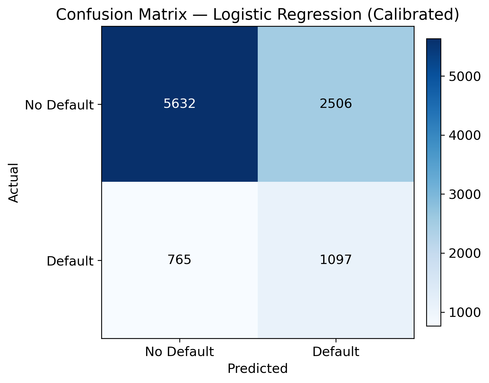
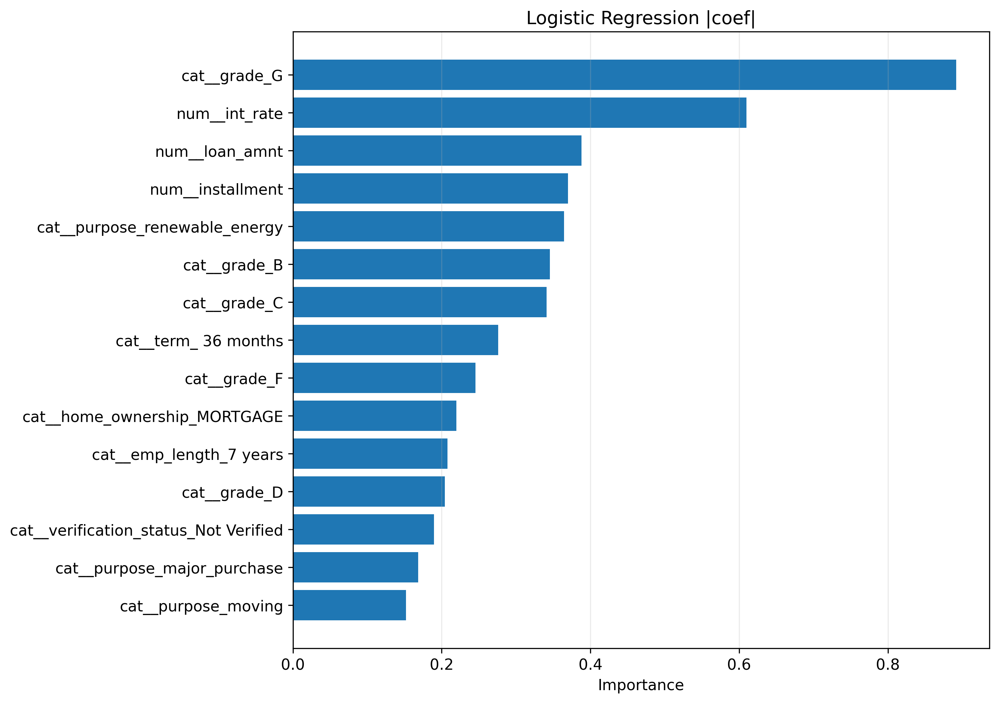
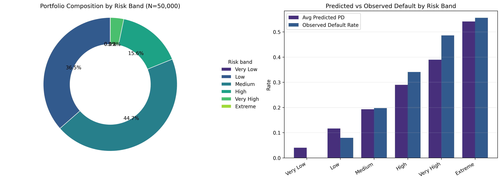
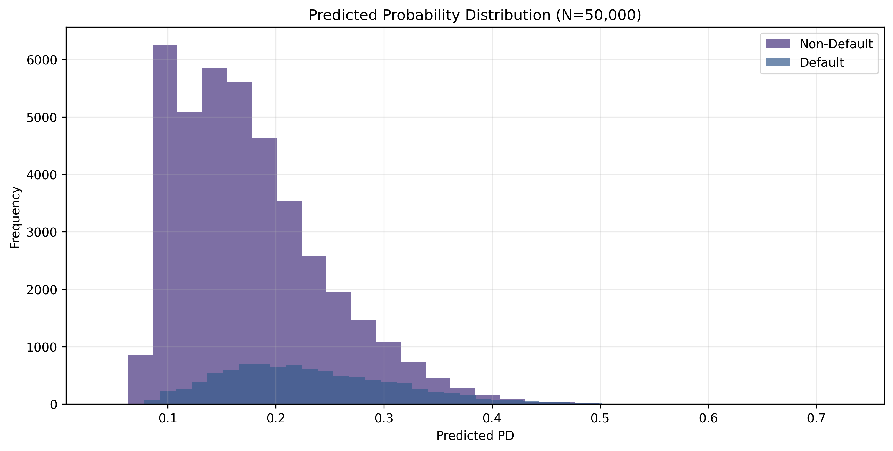

# Credit Risk Prediction & Portfolio Segmentation

[](https://www.python.org/)
[](project/LICENSE)
[](project/app.py)

Train a **Probability of Default (PD)** model and turn the scores into actionable **risk bands** to understand your portfolio mix.

This repository is intentionally clean: only `README.md` + `requirements.txt` live at the root. Everything else is under `project/`.

> This project runs on **50,000 loans** by default and generates the visuals from that run.

---

## Table of contents

- Background
- Project
- Pipeline
- Dataset
- Model performance
- Deliverables
- Getting started
- Technologies
- Top-directory layout
- License
- Author

---

## Background

Credit risk modelling estimates the likelihood that a borrower will default. In practice, model outputs become **portfolio actions**:
who to approve, what to price, where to tighten policy, and which segments need monitoring.

---

## Project

This project builds a baseline **PD model** using leakage-safe preprocessing and then converts predicted probabilities into portfolio **risk bands**.

What you get:

- A trained PD model (saved as a scikit-learn Pipeline)
- Holdout evaluation (ROC AUC + confusion matrix)
- Portfolio segmentation on the **full 50k loans** (risk-band mix + observed default rates)
- A Streamlit app to score new CSV files

---

## Pipeline

'''
1. Load LendingClub data (50k sample)
2. Clean + feature selection
3. Train/test split
4. Preprocess (impute + one-hot + scale)
5. Train models
6. Evaluate on holdout
7. Score full portfolio (50k)
8. Risk bands + portfolio summary
'''
---

## Dataset

- Source: LendingClub public loan data (downloaded via `kagglehub`)
- File used: `accepted_2007_to_2018Q4.csv`
- Run size: **50,000 rows** (controlled by `--sample-size 50000`)

---

## Model performance

Model performance is reported on a **holdout test split** (by default 20% of the loaded data), so the results are not overly optimistic.

Generated artifacts:

- Metrics: `project/results/model_metrics.csv`
- Confusion matrix: `project/results/03_confusion_matrix.png`
- ROC curves: `project/results/02_roc_curves.png`

---

## Deliverables

After a run, you will have:

- `project/results/REPORT.md` (GitHub-friendly report)
- `project/results/model_metrics.csv`
- `project/results/portfolio_analysis.csv`
- Plots (PNG) saved into `project/results/`

To keep the README plots up to date, copy the latest plot images:

```bash
python project/scripts/sync_assets.py --results-dir project/results --assets-dir project/assets/plots
```

---

## Results (50,000-loan run)

All plots use a **consistent color palette** so they look clean in GitHub.

**Model comparison**  


**ROC curves**  


**Confusion matrix (chosen threshold)**  


**Feature importance (model-dependent)**  


**Portfolio segmentation (risk bands)**  


**PD distribution (full portfolio)**  


---

## Getting started

### 1) Install

```bash
pip install -r requirements.txt
```

### 2) Run training + evaluation + segmentation (50,000 loans)

```bash
python project/main.py --sample-size 50000
```

Open:

- `project/results/REPORT.md`
- `project/results/portfolio_analysis.csv`

### 3) Run Streamlit app (optional)

```bash
streamlit run project/app.py
```

---

## Technologies

- Python
- pandas, NumPy
- scikit-learn (Pipelines + ColumnTransformer)
- matplotlib
- Streamlit (optional)

---

## Top-directory layout

```text
.
├── README.md
├── requirements.txt
└── project/
    ├── app.py
    ├── main.py
    ├── credit_risk/
    ├── assets/
    ├── scripts/
    └── results/
```

---

## License

Distributed under the MIT License. See `project/LICENSE` for more information.

---

## Author

- PiyushUCD
