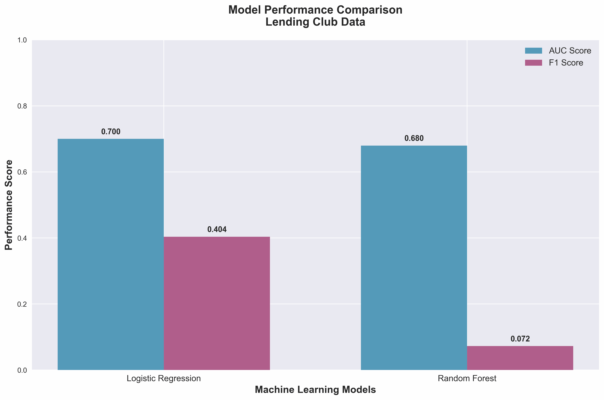
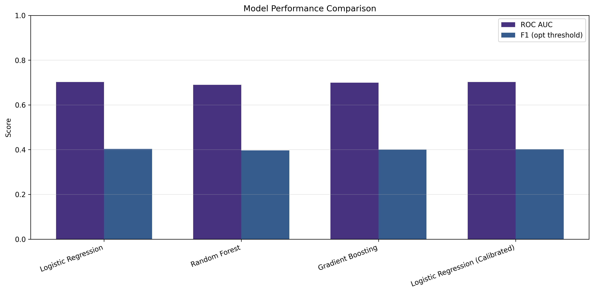
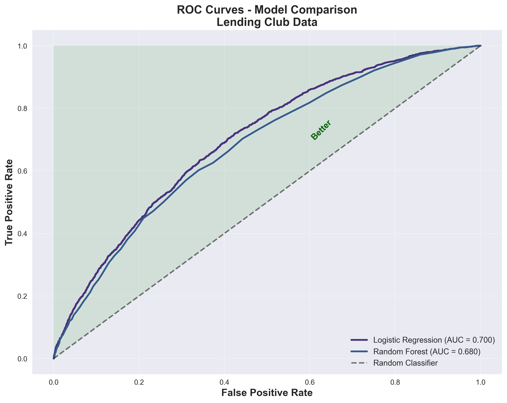
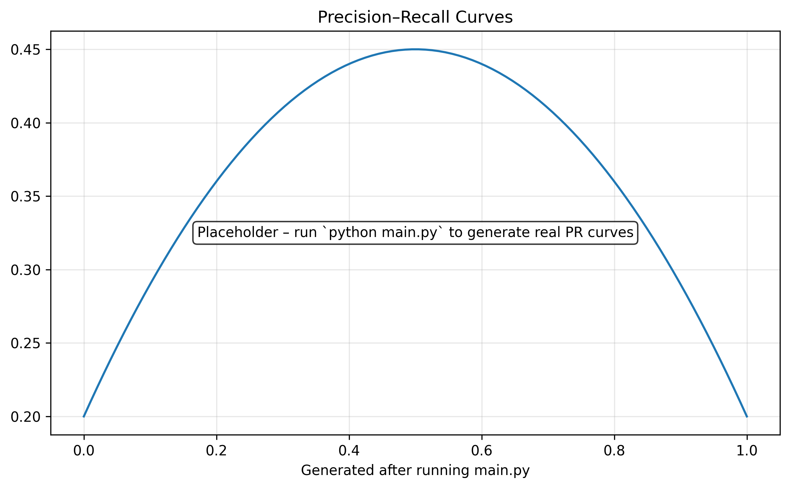
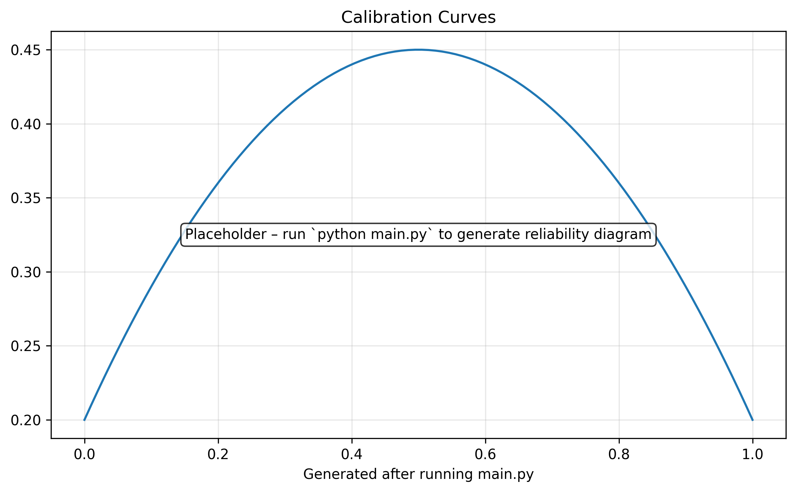
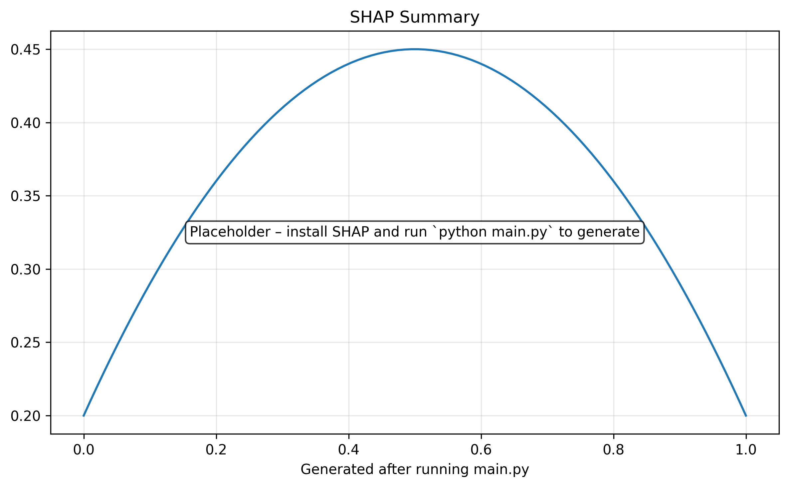
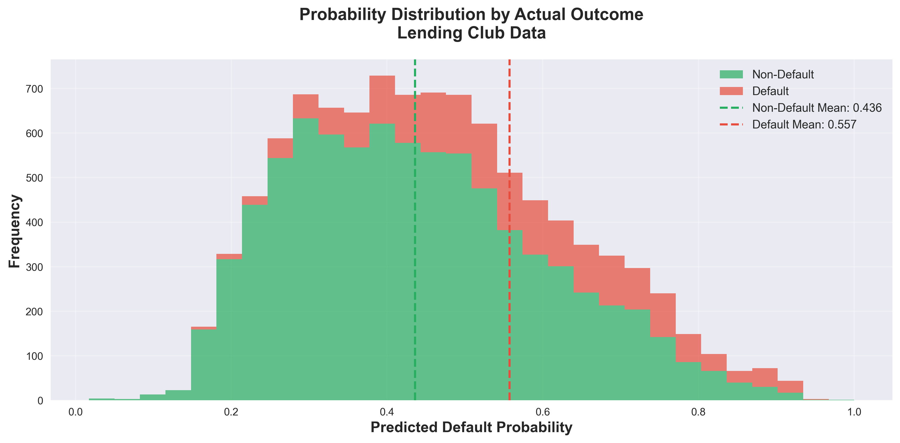
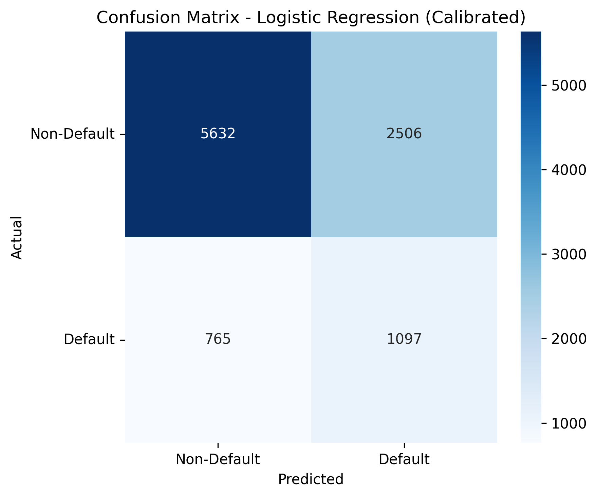
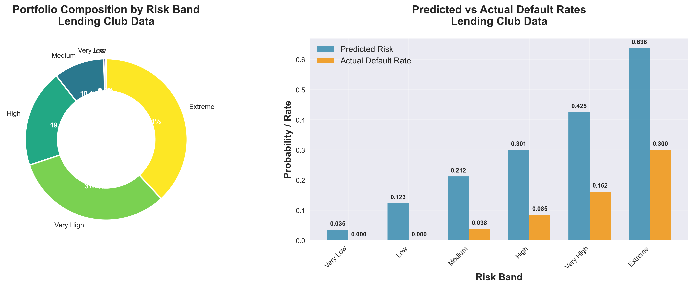

# Credit Risk Prediction & Portfolio Segmentation

[](https://github.com/PiyushUCD/Credit-Risk-Prediction-and-Portfolio-Segmentation/actions/workflows/ci.yml)
[](https://www.python.org/)
[](LICENSE)
[](app.py)

<!-- After you deploy on Streamlit Community Cloud, replace the link below with your app URL -->
[](https://share.streamlit.io/)

Train a **Probability of Default (PD)** model (leakage-safe preprocessing), then convert PDs into **portfolio risk bands** with segment-level analytics.
Includes a **Streamlit demo** that lets anyone upload a CSV and get scored outputs.

---

## Demo (what recruiters will see)



> Tip: run the app locally in ~60 seconds (instructions below).

---

## Portfolio case study (how to talk about this project)

**Problem**
- Predict default risk (PD) for loan applicants and transform model scores into actionable **portfolio segments**.

**Approach**
- Leakage-safe preprocessing using `Pipeline` + `ColumnTransformer` (imputation, one-hot encoding, scaling)
- Train multiple candidate models → pick best by validation metrics
- Evaluate with ROC/PR curves, confusion matrix, threshold tuning, PD distribution
- Segment the portfolio into risk bands and summarize **mix / observed default rate / expected-loss style proxy**

**Example results (from a 50,000-loan run)**
- Strong rank-ordering (ROC AUC around **0.70** is typical for this baseline feature set)
- Portfolio segmentation highlights concentration in higher-risk bands, helping you prioritize reviews and monitoring

> For your exact numbers, run `python main.py --sample-size 50000` and open `results/REPORT.md`.

### Model metrics (holdout evaluation)

Metrics are computed on a **held‑out test split** (default: 20% of the loaded sample) to avoid optimistic results.
The project also reports **PR‑AUC**, **Brier score**, and a simple **defaults-captured@top‑10%** lift-style metric.

- Test metrics CSV: `results/model_metrics.csv`
- Best model pipeline: `models/best_credit_risk_model.pkl`

### Portfolio segmentation summary (full portfolio)

Portfolio segmentation is computed on **the full loaded portfolio** (e.g., **50,000 loans** when `--sample-size 50000`).
This is what drives the business-facing visuals and the risk-band summary.

- Portfolio table CSV: `results/portfolio_analysis.csv`
- Loan-level output (if enabled): `results/portfolio_loan_level.csv`

> Tip: After you run `python main.py --sample-size 50000`, open the CSVs above and the plots in `results/`.
> You can paste your latest tables back into this README if you want the repo to always display your most recent run.


## Results preview (generated artifacts)

**Model comparison**  


**ROC curves**  


**Precision–Recall curves**  


**Feature importance (model-dependent)**  


**Calibration (reliability) curves**  


**SHAP global summary (optional)**  


**PD distribution**  


**Confusion matrix (chosen threshold)**  


**Portfolio segmentation**  


---

## Quickstart

### 1) Install
```bash
python -m venv .venv
# mac/linux
source .venv/bin/activate
# windows
# .venv\Scripts\activate

pip install -r requirements.txt
```

If you only want the training pipeline (no Streamlit/SHAP):
```bash
pip install -r requirements-core.txt
```

### 2) Run training + evaluation + segmentation
```bash
python main.py --sample-size 50000
```

This run also writes a GitHub-friendly report:
- `results/REPORT.md`

Update the README plots (copies `results/*.png` → `assets/plots/`):
```bash
python scripts/sync_assets.py
# or: make sync-assets
```

Useful flags:
```bash
python main.py --tune --tune-iter 30
python main.py --threshold cost
python main.py --no-calibrate
```

---

## Streamlit app

The one-command install already includes Streamlit/SHAP via `requirements.txt`.

Run:
```bash
streamlit run app.py
```

The app supports:
- Upload CSV → score PD → assign risk band → download scored dataset
- Optional explainability (global importance; SHAP if installed)

### Deploy on Streamlit Community Cloud

1. Push this repo to GitHub
2. Go to Streamlit Community Cloud → **Create app**
3. Select your repo and set:
   - **Main file path**: `app.py`
4. Deploy 🎉

Notes:
- The Cloud builder installs from `requirements.txt` (this repo's file includes both core + app deps)
- If you want a lighter deploy, edit `requirements.txt` to remove SHAP

See: `docs/DEPLOY_STREAMLIT.md`

## Project structure

```text
credit_risk/
  data_loader.py
  model_trainer.py
  model_evaluator.py
  portfolio_analyzer.py
  explainability.py
  visualizer.py
  helpers.py
assets/
  streamlit_demo.gif
  plots/
data/
  sample_input.csv
tests/
.github/
```

---

## Documentation
- `MODEL_CARD.md` — what the model is, how it was trained, limitations
- `ARCHITECTURE.md` — pipeline + design notes
- `DATA.md` — expected schema & assumptions

---

## License
MIT — see `LICENSE`.
